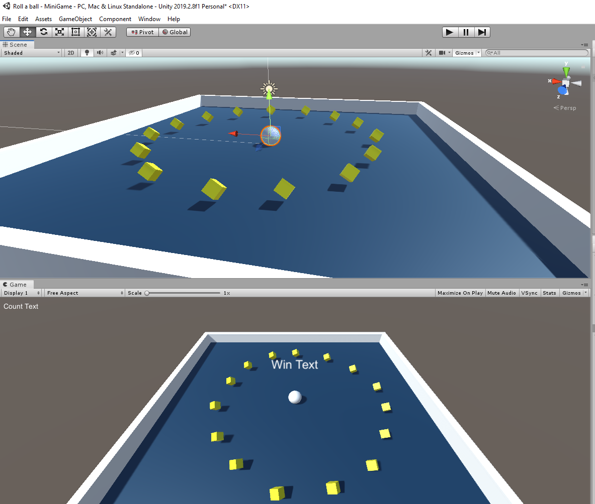

## Roll-a-ball
 Roll-a-ball is a unity project for simply rolling a ball and collecting points based on the cubes collected. I have implemented this game in VR.

## Resources
* [Roll-A-Ball Project](https://learn.unity.com/project/roll-a-ball-tutorials) - Project details

## Screenshot
 
